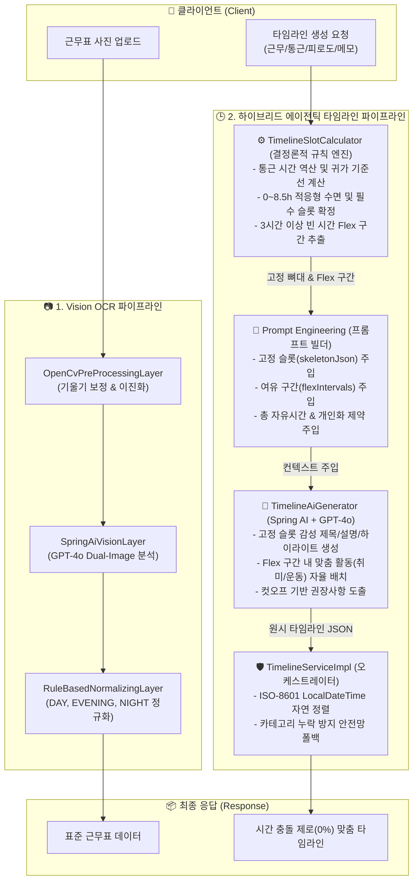
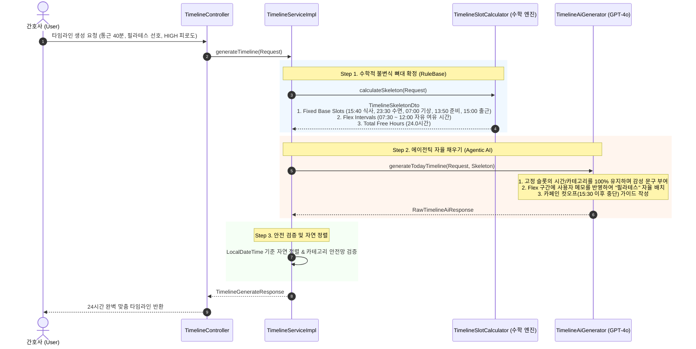

# 🏥 AiServer 시스템 아키텍처 및 개발 가이드

이 문서는 3교대 근무 간호사를 위한 **근무표 OCR 이미지 인식** 및 **규칙 엔진(RuleBase)과 생성형 AI(GPT-4o)의 에이전틱 협업 기반 맞춤형 웰니스 타임라인 생성 서버(`AiServer`)**의 구조와 핵심 기능을 설명합니다.

---

## 1. 프로젝트 개요 (Overview)

- **핵심 미션**: 불규칙한 3교대 근무 간호사의 생체 리듬을 보호하고 피로를 줄여주는 24시간 개인 맞춤형 라이프케어 코칭
- **기술 스택**: Java 17, Spring Boot 4.1.0, Spring AI 2.0.0, OpenAI GPT-4o, OpenCV 4.9.0, Gradle
- **핵심 아키텍처 철학**: 
  - **"시간표의 수학적 뼈대(Hard Invariants)는 규칙 엔진이 100% 보장하고, 살과 감성(Agentic Content)은 AI가 채운다" (하이브리드 슬롯 필러 시스템)**

---

## 2. 전체 시스템 파이프라인 (Mermaid Architecture)

### 📊 1. End-to-End 전체 시스템 아키텍처



---

## 3. 규칙 엔진(RuleBase)과 생성형 AI(Agentic AI)의 협업 메커니즘

순수 LLM만으로 시간표를 생성하면 시간 겹침, 과다 수면(14시간 수면 등), 과거 시간대 생성 등 **시간 역학적 할루시네이션**이 발생합니다. AiServer는 이를 **결정론적 규칙 엔진과 자율형 AI의 명확한 역할 분담(Agentic Collaboration)**으로 해결했습니다.



---

## 4. 역할 분담 상세 비교표 (RuleBase vs Agentic AI)

| 구분 | ⚙️ 규칙 엔진 (`TimelineSlotCalculator`) | 🤖 생성형 AI (`TimelineAiGenerator`) |
| :--- | :--- | :--- |
| **주요 역할** | **물리적/수학적 시간표 뼈대 확정 (Hard Invariants)** | **개인화된 콘텐츠 및 감성 케어 생성 (Agentic Content)** |
| **시간 계산** | - 퇴근 시각 + 통근 시간 = 귀가 시각(`homeArrival`)<br/>- 다음 출근 - 통근 - 준비 = 출근 준비 시각 역산<br/>- 과거 시간대 슬롯 원천 배제 | 시간 계산을 직접 하지 않고 주어진 `time`을 100% 준수 |
| **수면 관리** | - 수면 상한(최대 8.5시간, 기본 7.5시간) 강제<br/>- 2~3시간 초단축 시 0시간/쪽잠(`NAP`) 자동 적응<br/>- NIGHT ➡️ DAY 1차/2차 분할 수면 슬롯 산출 | - 수면 품질 향상 팁(암막커튼, 안대, 조명 낮추기)<br/>- 개인 피로도 회복을 위한 따뜻한 공감 문구 |
| **여유 시간** | 필수 슬롯 사이 3시간 이상 빈 시간을 `flexIntervals`로 추출 | 여유 시간대에 사용자 메모(`userNotes`)를 반영한 활동(필라테스, 친구 약속, 산책 등) 자율 배치 |
| **출력 산출물** | `BaseSlotDto` 리스트 (시간, 카테고리, 표준 소요시간) | `title`, `description`, `highlight`, `recommendations` |

---

## 5. 실전 협업 사례: Case 4 (DAY ➡️ EVENING) 동작 흐름

간호사가 **"15:00 퇴근, 내일 15:00 출근, 편도 통근 40분, 점심 친구 약속 있음, 피로도 HIGH"**로 요청했을 때의 처리 과정입니다.

```mermaid
graph LR
    subgraph Input["입력 데이터"]
        I1["퇴근: 8/20 15:00"]
        I2["출근: 8/21 15:00"]
        I3["통근: 40분"]
        I4["메모: 점심 친구 약속"]
    end

    subgraph RuleEngine["1. TimelineSlotCalculator (수학적 뼈대)"]
        R1["8/20 15:40 | MEAL (퇴근+40분 귀가)"]
        R2["8/20 23:30 | SLEEP (7.5h 수면 상한)"]
        R3["8/21 07:00 | WAKE_UP (기상)"]
        R4["8/21 12:20 | MEAL (점심 식사)"]
        R5["8/21 13:50 | PREPARATION (15:00-40분-30분)"]
        R6["8/21 15:00 | WORK (근무 시작)"]
        R_FLEX["Flex: 07:30 ~ 12:00 (오전 여유)"]
    end

    subgraph AI["2. TimelineAiGenerator (GPT-4o 살 붙이기)"]
        A1["'귀가 후 식사 및 휴식' (맛있는 식사와 휴식)"]
        A2["'취침' (권장 수면: 7시간 30분)"]
        A3["'기상' (상쾌한 아침 시작)"]
        A4["'점심 식사' ('친구와의 약속을 즐기며 든든한 점심!')"]
        A5["'출근 준비' (통근 및 근무 준비)"]
        A6["'EVENING 근무 시작'"]
        A_REC["'15:30 이후 카페인 섭취 중단 및 수분 보충'"]
    end

    Input --> RuleEngine
    RuleEngine --> AI
```



---

## 6. 핵심 상수 및 제약조건 요약

```java
// 🕒 소요 시간 표준 범위 상수 (TimelineSlotCalculator)
public static final long MIN_SLEEP_MINUTES = 0L;       // 초단축 교대 시 0분(쪽잠/휴식 대체) 가능
public static final long DEFAULT_SLEEP_MINUTES = 450L; // 7.5시간 (표준 권장 수면)
public static final long MAX_SLEEP_MINUTES = 510L;     // 8.5시간 (수면 버퍼 포함 최대 상한)

public static final long MIN_NAP_MINUTES = 30L;        // 30분 파워 낮잠
public static final long DEFAULT_NAP_MINUTES = 90L;    // 1.5시간 (야간 출근 전 표준 낮잠)

public static final long MIN_MEAL_MINUTES = 20L;       // 20분 (단축 야식)
public static final long DEFAULT_MEAL_MINUTES = 40L;   // 40분 (일반 식사)
public static final long MAX_MEAL_MINUTES = 45L;       // 45분 (출근 전 든든한 식사)

public static final long MIN_PREP_MINUTES = 20L;       // 20분 (단축 준비)
public static final long DEFAULT_PREP_MINUTES = 30L;   // 30분 (표준 출근 준비)
```

- **표준 카테고리 (8종)**: `SLEEP`, `NAP`, `PREPARATION`, `WAKE_UP`, `MEAL`, `WORK`, `REST`, `EXERCISE`
- **시간 표현 포맷**: `YYYY-MM-DDTHH:mm` (ISO-8601)

---

## 7. 패키지 디렉토리 구조

```text
AiServer/
├── src/main/java/com/likeLion/backend/aiserver/
│   ├── AiServerApplication.java           ← 메인 엔트리포인트 (.env 로더)
│   ├── controller/
│   │   ├── TimelineController.java        ← 타임라인 생성 REST API (/api/timeline/generate)
│   │   └── ScheduleAnalyzeController.java ← 근무표 이미지 분석 REST API (/api/schedule/analyze)
│   ├── dto/
│   │   ├── ShiftType.java                 ← DAY, EVENING, NIGHT, OFF 표준 Enum
│   │   └── timeline/
│   │       ├── BaseSlotDto.java           ← 수학적 고정 슬롯 모델
│   │       ├── TimelineSkeletonDto.java   ← 뼈대 및 여유 구간 모델
│   │       ├── TimelineGenerateRequest.java
│   │       └── TimelineGenerateResponse.java
│   ├── service/
│   │   ├── TimelineService.java
│   │   ├── TimelineServiceImpl.java       ← 타임라인 정렬 및 오케스트레이터
│   │   └── layer/
│   │       ├── TimelineSlotCalculator.java← 규칙 기반 결정론적 수학 계산 엔진
│   │       ├── TimelineAiGenerator.java   ← Spring AI + GPT-4o 연동 엔진
│   │       ├── OpenCvImagePreprocessor.java
│   │       └── SpringAiVisionLayer.java
│   └── exception/
│       └── GlobalExceptionHandler.java    ← 전역 예외 처리
└── src/main/resources/
    ├── application.properties             ← GPT-4o 모델 및 설정
    └── prompts/
        ├── timeline_future.st             ← FUTURE 모드 프롬프트 템플릿
        └── timeline_today.st              ← TODAY 모드 프롬프트 템플릿
```
